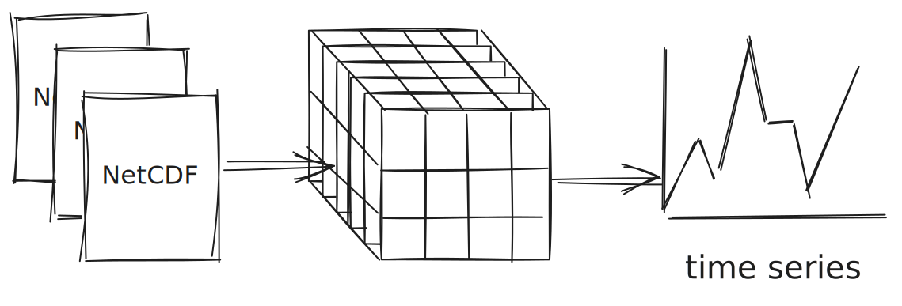

This report outlines the current state of virtual stores at NASA. It's intended primary audience is program leads at NASA looking to understand the current state and make informed decisions about how to drive enterprise-wide technical directions. It's secondary audience is technical folks looking for examples of virtual stores at NASA and how they integrate with the NASA ecosystem.

**If you are a program lead,** it is suggested to start here with the main points about virtual stores. Then it is recommended to visit the [Executive Summary](./executive_summary.qmd) and [Recommendations](./recommendations.qmd). From there, you will likely want to also make note of the [Limitations](./limitations.qmd) and [Governance](./governance.qmd) sections.
**If you are looking to understand virtual stores at NASA on a more technical level,**, please visit the Technical Aspects sections. The [Resources](./resources.qmd) may also be of interest.

## Vision: NASA datasets accessible through a single entrypoint

Virtual stores deliver a single entrypoint to a dataset comprised of many files. For NASA datasets this enables:

* Less pre-processing to be "analysis-ready".
* Users do not have to know about the underlying data format or storage location.
* Greater interoperability through a common API for reading, writing and analyzing complex and heterogeneous NASA datasets.
* Better performance and reduced costs as less data -- only the data the user needs -- is sent over the internet.

## What are virtual stores and what do they enable?

Core to virtual store technology is lightweight metadata pointing to data byte ranges in existing files. Virtual store technology enables data users to access subsets of large scientific datasets without downloading, scanning, or pre-processing any files.

## Benefits for data users

- Logical dataset access across a large number of files, without downloading any data, and regardless of local or in-region compute location
- Consistent access patterns across diverse data types

## Benefits for data providers and NASA

- Cost savings through reduced egress and compute
- Providing analysis-ready access to existing archives without reformatting
