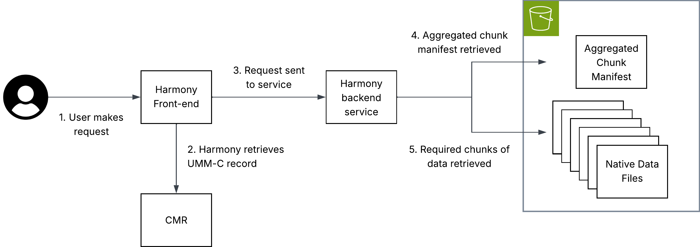

There are a number of components to consider when envisioning virtual stores and their place in the broad NASA data ecosystem.

Virtual stores provide a uniform interface to archival data through the Zarr data model and specification. However, to access and visualize this data, the ecosystem needs to adapt to integrate the Zarr data model and specification. While `xarray` and `zarr-python` provide powerful tools for working with this data, a number of existing powerful tools at NASA need to be considered to support NASA users.

## Integration with EGIS

Access to NASA data through Geographic Information Systems (GIS) is essential for supporting the agency’s broad user community. [Earthdata GIS (EGIS)](https://gis.earthdata.nasa.gov/portal/home/index.html) is NASA’s dedicated GIS platform. Integrating EGIS with virtual stores will ensure that both users and developers benefit from the foundational work to design and deliver virtual views into complex NASA data volumes.

## Integration with Harmony

[Harmony](https://harmony.earthdata.nasa.gov/docs) is an ESDIS Project enterprise system for managing transformation requests for NASA Earth science data. It offers users the capability to retrieve the data they need in a format that is appropriate for their use cases. Users can request spatial, temporal and variable subsets. Results can be reprojections and/or aggregations of data originally hosted in multiple archived files.

Traditionally, Harmony has performed operations on the archival data files in the ESDIS Project archive that are represented via metadata hosted in the Common Metadata Repository (CMR). A virtual store offers several potential benefits to a system such as Harmony:

* Only retrieving relevant bytes of archival data files, which would limit the amount of data held in-memory and stored in compute environments, while potentially offering significant performance improvements.
* Removing the need for services that stack data from multiple individual input files, as this aggregation will have already occurred.
* Allowing for analyses of a data collections as a single entity (e.g., long duration time series).
* Reducing complexity of code within services by utilizing common tools such as xarray.
* Allowing the same services to work on different archival data formats, as they can interact with a virtual data store layer using the same client software.

### Harmony virtual data store architecture



The diagram above illustrates how virtual data access can be used within the NASA ecosystem in a transformation service hosted in Harmony.

Key to this implementation is that metadata must be hosted in the CMR, allowing Harmony to identify the location of an aggregated chunk manifest. This chunk manifest is read by the Harmony service, allowing it to perform subsetting and only interact with the chunks that are necessary to fulfil the user's request.

Note: The aggregated chunk manifest does not have to be co-located with the archival data files to which it refers.

### Further considerations

The following considerations are explained in detail below.

* Data volume
* Derived products
* Consistent cataloguing in CMR

#### Data Volume

Harmony is designed to return a URL to the user pointing at a single output data object. With virtual data stores which represent a large number of files, safeguards may be required to handle computationally intensive transformations. To understand why, a basic introduction to Harmony is required:

Currently, Harmony users can request transformation of any number of files in a data collection. For most use cases, this means parallelizing the processing of multiple inputs (usually files) in different Kubernetes pods. Aggregation may occur but, generally, a single pod only needs to download, process and output a single object with a comparable size to an archival data file. In other words, input size is roughly output size because inputs _and_ outputs are typically single files. Currently, if a virtual data store is sent as the "input" to a single Harmony invocation, processing and construction of an output would all still happen in one Kubernetes pod, regardless of the number of files the virtual data store references. If a single file-like output object is requested, that output file object could become too large for traditional download-based workflows.

A potential solution to this could be identifying high-volume outputs and outputting a Zarr store or a virtual store with new files.

#### Derived products

Virtual data stores are especially useful for partial data access, such as spatial, temporal, or variable subsetting. In these cases, users may not need the full Harmony infrastructure and can instead draw on Harmony’s open-source code to learn how to directly query virtual data stores using tools like xarray.

However, some operations -- such as reprojection -- modify the underlying data and produce a new output. In these cases, a derived file is still needed, consistent with Harmony’s traditional role of generating outputs for on-demand transformation requests. Even then, virtual data stores remain valuable: they minimize data access and make it easier to combine data from multiple source files.

#### Consistent cataloguing in CMR

As an ESDIS Project enterprise software application, Harmony relies on CMR metadata. For a Harmony service to offer transformation capabilities to a broad selection of data in the ESDIS Project archive, the representation of virtual data stores needs to be consistent between different data collections.

For further discussion of metadata representations in CMR, see [Metadata Placement Standards](./governance.qmd#metadata-placement-standards).

## Discovery and integration with CMR

For the related governance decisions on metadata placement standards, see [Governance](governance.qmd#metadata-placement-standards).

## Integration with earthaccess

[`earthaccess`](https://earthaccess.readthedocs.io/en/latest/) currently supports data virtualization (via VirtualiZarr) that can be used to streamline the creation and access of virtual stores.
The current implementation allows end-users and data providers to generate a virtual store at scale with a **single line of code**. Scale is delivered using the parallel executors API from Virtualizarr which utilizes a Dask cluster or Lithops if configured.

```python
import earthaccess as ea

granules = ea.search_data(**params)

vds = ea.virtualize(granules, **virtualizarr_options)

# then we can persist the vds into kerchunk or icechunk
vds.virtualize.to_kerchunk(*args)
# or 
vds.virtualize.to_icechunk(*args)

```

This approach allows users to easily create virtual stores from their search results, and then persist those virtual stores without having to manually configure anything (I/O drivers and authentication).

By using CMR search results earthaccess enables creation of tailored virtual stores. Virtual stores can be created "on the fly" using only the subset of files that meet certain criteria. Use cases include creating seasonal and regional datasets.

Once a virtual store is created, updating it will also be streamlined with `earthaccess`. Once the store's metadata is listed in a CMR collection-level record or a new UMM association,  then we will be able to use `earthaccess` to update the virtual store with new granules that get added to the collection, or even remove granules that get deleted from the collection. This would allow users to maintain up-to-date virtual stores without having to manually track changes to the underlying data.

```python

collection = ea.search_datasets(
  short_name="SPL4SMGP"
)[0]

icechunk_store = ea.open_virtual_store(collection, name="yearly_store")

# then we can use a CMR search to look for new granules with created_at
params = {
  "created_at": <latest timestep of icechunk store + 1 timestep>
}
new_granules = ea.search_data(**params)
new_vds = ea.virtualize(new_granules, **vz_options)

# append the new to the current store
new_vds.virtualize.to_icechunk(icechunk_store, append_dim="time")
```

The same way, we can use `icechunk_store` to open it using xarray and visualize it with tools like `hvplot` or `matplotlib`.

```python
ds = xr.open_zarr(icechunk_store, consolidated=False, zarr_format=3)
```
