## Design files, chunks, and aggregated chunk manifests around typical use case patterns

The most important design input for a new data product is understanding how the data will most commonly be accessed.
With virtual data stores (VDS), you cannot change the chunks of the underlying files. This matters because more chunks along a dimension means slower access across that dimension.

A useful analogy: pancakes vs. churros.

* A pancake chunk holds the full spatial extent at one timestep. Loading a global snapshot is fast because it's all in one chunk. Time series are slow because each timestep is stored in a separate chunk.
* A churro chunk holds many timesteps for a small spatial location. Time series are fast for a spatial subset, but global views are slow.

This is a real problem in practice: many datasets store one file per timestep, which makes data collection straight-forward but is not optimized for time series access.

Chunk shape should be a deliberate design decision, made with awareness of the tradeoffs.

VDSs are often built after data product decisions have already been made. What you can still control is the manifest, where you can make changes to what variables are represented and in what composition. For examples, see [Virtual Stores at NASA](./nasa-applications.qmd).

## Adopt icechunk

[Icechunk](icechunk.io) should be adopted but with risk mitigation measures. Icechunk is a transactional storage engine for Zarr. In other words, it is a way to manage Zarr stores the same way you would with many traditional databases. Icechunk technology supports the following operational needs of many NASA datasets:

* Safety: Changes to a store can be made safely through ACID transactions which ensure all dependent updates are either committed together or rolled back together. Corrupted data can easily be fixed by rolling back to a previous snapshot.
* Stability: Some production workflows may depend on Icechunk stores and pointing to a specific version ensures stability.

Reference: [https://icechunk.io/en/stable/overview/](https://icechunk.io/en/stable/overview/).

While Icechunk is open source, this technology is maintained by a small and external development team. This introduces a risk which is a dependency on that external development team. NASA should mitigate this risk by funding icechunk maintenance and development. 

More specifically, NASA should work on:

* development of parsing chunk manifests back out of Icechunk; this will enable chunk manifests to be read back out of icechunk stores and stored in another format;
* Icechunk maintenance; and,
* Icechunk readers in other languages (C/C++, Julia, R, etc.).

## Adopt GeoZarr standards

Adoption of [GeoZarr](https://geozarr.org/) is recommended to ensure interoperability with the developing GeoZarr ecosystem of tooling.

## Leverage existing tools, services and available chunk metadata.

To build virtual data stores efficiently, existing open-source tooling (Icechunk, Kerchunk, etc.) should be leveraged, rather than implementing solutions from scratch.
When a collection is consistent and OPeNDAP-supported, [DMRPP](https://opendap.github.io/DMRpp-wiki/DMRpp.html) metadata can be used instead of reading metadata from source files. DMRPP reading is faster and can represent various archival formats.

For collections lacking DMRPP, fall back to native metadata parser. However, DMRPP has caveats that OPeNDAP should address: standardizing DMRPP across all collections,
adding checksum validation at generation time, and possibly adopting a lighter schema or Parquet serialization.

## Prioritize EGIS integration planning

Integration with the Earthdata Geographic Information System (EGIS) has been identified as a future priority. Scoping should begin to ensure integration with EGIS is smooth.

## Address Governance Gaps

The governance decisions identified in [Governance](governance.qmd) — metadata placement standards, versioning policies, and stewardship ownership — should be addressed as virtual store technology is deployed more broadly across DAACs.

## Streamline end-user experience

The [authentication and credential complexity](
limitations.qmd#authentication-and-credential-complexity) currently
required to open a virtual store is a significant barrier to
adoption. For virtual stores to see broad use, the path from
Earthdata Login to an open xarray Dataset or Datatree should be reduced to a
store identifier and authentication — comparable to the experience
earthaccess already provides for direct file access.

## Documentation and onboarding

Virtual store documentation is already underway — PO.DAAC's cookbook chapter, ASDC's demo notebooks and [Resources](./resources.qmd) all represent ongoing efforts. The next step is consolidating and improving these materials to serve two distinct audiences: data providers virtualizing datasets, and data users accessing virtual stores.

* Provider-facing documentation should develop the existing worked examples into reusable templates covering format-specific considerations, chunking decisions, and validation.
* User-facing documentation should lower the barrier to working with virtual stores — particularly around authentication setup, available access patterns, and how virtual store access differs from traditional file-based workflows

Coordinating these efforts across DAACs will reduce duplication and help establish consistent guidance as adoption grows.
